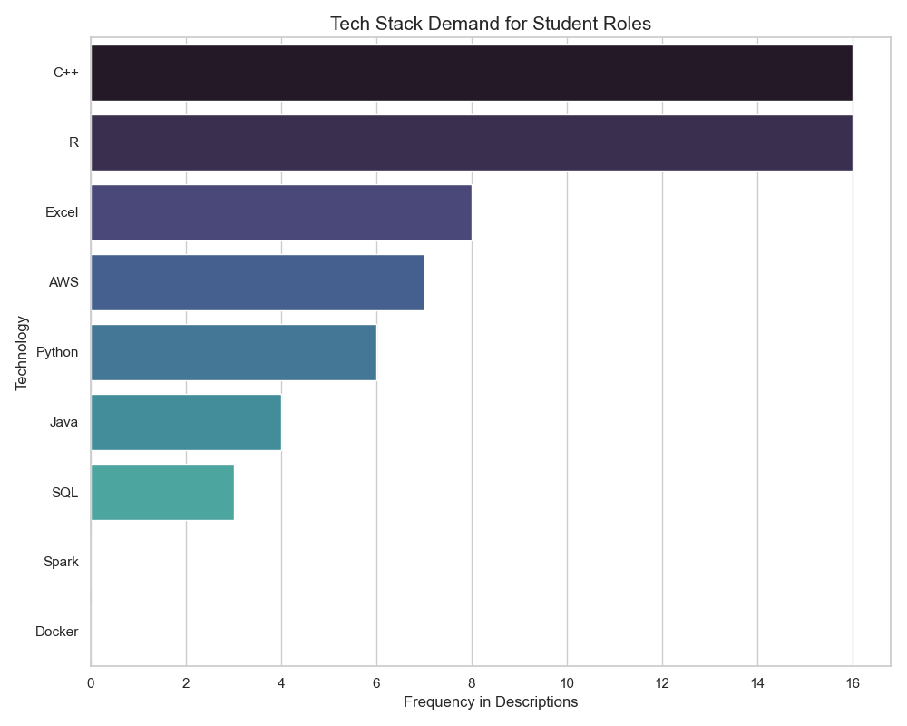

# Student-Tech-Market ETL: Automated Israel Entry-Level Job Tracker

An automated ETL pipeline that extracts, transforms, and visualizes tech job opportunities for students in Israel.

## Features
* **Extract**: Pulls real-time job data from JSearch API.
* **Transform**: Cleans data using Pandas, removes duplicates, and filters for relevant roles.
* **Load**: Stores processed data in a SQLite database for persistence.
* **Visualize**: Generates insights on the most demanded technologies in the current market.

## Tech Stack
* Python (Pandas, Matplotlib, Seaborn)
* SQLite
* GitHub Actions (CI/CD)

## Visual Insights

## How to Run
1. Clone the repository.
2. Install dependencies: `pip install -r requirements.txt`.
3. Add your API key to `api_keys.py`.
4. Run `python main.py`.